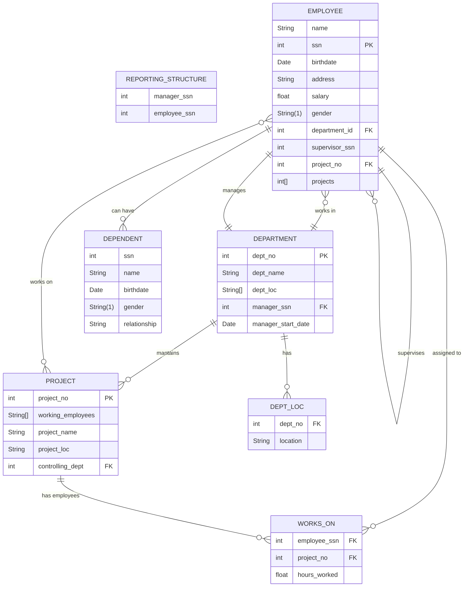

# EmployeeManagement-Assignment

DBSA Project for making an employee managment system

#### 1. DATABASE ER DIAGRAMS:

##### Entities:

- Emplyee
- Department
- Project
- Dependent
- Reporting Structure

##### ER Diagram



```markdown
# Open Questions

- Each department has a unique department number, a department name, and can <operate across multiple locations.>
- Employees can work on multiple projects, and each project can have multiple employees assigned. For each assignment, the system must record the number of hours worked by an
  employee.
```

#### 2. Relational Database Schema

##### Tables and Keys

##### DEPARTMENT

| Column             | Type    | Key                        |
| ------------------ | ------- | -------------------------- |
| dept_no            | INT     | PRIMARY KEY                |
| dept_name          | VARCHAR |                            |
| manager_ssn        | INT     | FOREIGN KEY (EMPLOYEE.ssn) |
| manager_start_date | DATE    |                            |

##### DEPT_LOC

| Column   | Type    | Key                              |
| -------- | ------- | -------------------------------- |
| dept_no  | INT     | FOREIGN KEY (DEPARTMENT.dept_no) |
| location | VARCHAR |                                  |

##### EMPLOYEE

| Column         | Type    | Key                              |
| -------------- | ------- | -------------------------------- |
| ssn            | INT     | PRIMARY KEY                      |
| name           | VARCHAR |                                  |
| birthdate      | DATE    |                                  |
| address        | VARCHAR |                                  |
| salary         | FLOAT   |                                  |
| gender         | CHAR(1) |                                  |
| department_id  | INT     | FOREIGN KEY (DEPARTMENT.dept_no) |
| supervisor_ssn | INT     | FOREIGN KEY (EMPLOYEE.ssn)       |
| project_no     | INT     | FOREIGN KEY (PROJECT.project_no) |

##### PROJECT

| Column           | Type    | Key                              |
| ---------------- | ------- | -------------------------------- |
| project_no       | INT     | PRIMARY KEY                      |
| project_name     | VARCHAR |                                  |
| project_loc      | VARCHAR |                                  |
| controlling_dept | INT     | FOREIGN KEY (DEPARTMENT.dept_no) |

##### WORKS_ON

| Column       | Type                       | Key                              |
| ------------ | -------------------------- | -------------------------------- |
| employee_ssn | INT                        | FOREIGN KEY (EMPLOYEE.ssn)       |
| project_no   | INT                        | FOREIGN KEY (PROJECT.project_no) |
| hours_worked | FLOAT                      |                                  |
| PRIMARY KEY  | (employee_ssn, project_no) |                                  |

##### DEPENDENT

| Column       | Type    | Key                        |
| ------------ | ------- | -------------------------- |
| ssn          | INT     | FOREIGN KEY (EMPLOYEE.ssn) |
| name         | VARCHAR |                            |
| birthdate    | DATE    |                            |
| gender       | CHAR(1) |                            |
| relationship | VARCHAR |                            |

##### REPORTING_STRUCTURE

| Column       | Type                        | Key                        |
| ------------ | --------------------------- | -------------------------- |
| manager_ssn  | INT                         | FOREIGN KEY (EMPLOYEE.ssn) |
| employee_ssn | INT                         | FOREIGN KEY (EMPLOYEE.ssn) |
| PRIMARY KEY  | (manager_ssn, employee_ssn) |                            |

#### 3. Normalization

Yes, the schema can be normalized. Below are the steps showing normalization up to Third Normal Form (3NF):

##### First Normal Form (1NF)

- All tables have atomic values (no repeating groups or arrays).
- Each field contains only one value.

##### Second Normal Form (2NF)

- All non-key attributes are fully functionally dependent on the whole of every candidate key.
- Composite keys (e.g., WORKS_ON, REPORTING_STRUCTURE) do not have partial dependencies.

##### Third Normal Form (3NF)

- All attributes are only dependent on the primary key (no transitive dependencies).
- For example, in EMPLOYEE, all columns depend only on `ssn`.

##### Normalized Tables

- **DEPARTMENT**: Each department is uniquely identified, manager info is separated.
- **DEPT_LOC**: Multiple locations for a department are stored separately.
- **EMPLOYEE**: Employee details are atomic, supervisor and department are referenced by foreign keys.
- **PROJECT**: Each project is uniquely identified, controlling department is referenced.
- **WORKS_ON**: Many-to-many relationship between employees and projects, with hours worked.
- **DEPENDENT**: Dependents are linked to employees by `ssn`.
- **REPORTING_STRUCTURE**: Manager-employee relationships are stored without redundancy.

The schema as presented is already normalized up to 3NF.
